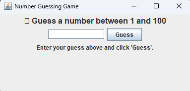

# 🎯 Task 02 - Number Guessing Game (Java GUI)

This project is part of the SkillCraft internship program. It is a GUI-based Java application that generates a random number and challenges the user to guess it. The application provides feedback based on the user's input and continues until the correct number is guessed.

---

## 🧩 Problem Statement

> Build a program that generates a random number and challenges the user to guess it.  
> The program should prompt the user to input their guess, compare it to the generated number, and respond accordingly.

---

## 🛠️ Technologies Used

- Java
- Java Swing (GUI)

---

## 🎮 Features

- Random number generation between 1 and 100
- GUI using Java Swing
- Input box for user guesses
- Real-time feedback:
    - Too High
    - Too Low
    - Correct Guess
- Displays number of attempts taken
- Reset option after successful guess

---

## 💻 How to Run

1. **Clone or Download** this repository.
2. **Compile the code** using a terminal:
   ```bash
   javac GuessTheNumberGUI.java
## 📸 GUI Preview
